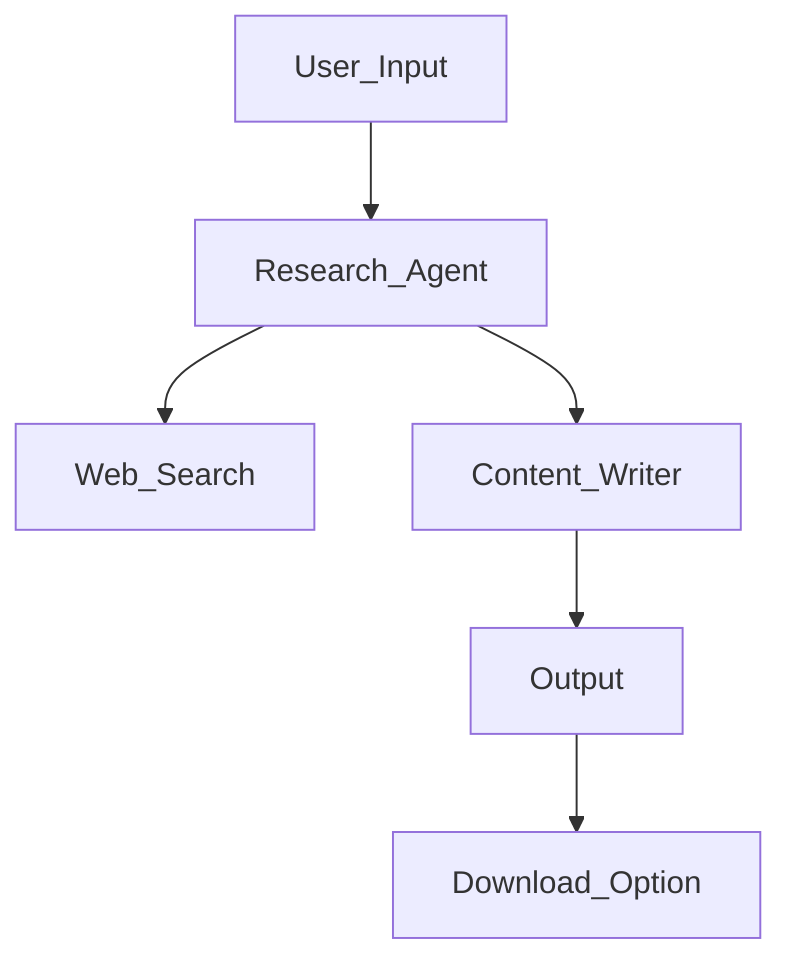

# Research AI Agent 


https://github.com/user-attachments/assets/e423c360-0103-4d5c-beb8-5aaa9d193bf0


This repository contains a basic AI Research Agent (just  a helloworld for AI Agents ), designed using **Streamlit**, **CrewAI**, **Serper API**, and **OpenAI API**. The system includes two agents:
1. **Research Agent**: Conducts real-time web searches and gathers insights.
2. **Content Writer Agent**: Processes the data and generates high-quality content with proper references.

Users can interact with the application via a simple Streamlit-based frontend, making it easy to input topics, adjust settings, and generate detailed responses with references.

---

## Key Features

- **Real-Time Research**: Uses **Serper API** for live web search.
- **AI-Driven Content Writing**: Powered by OpenAI's LLMs for high-quality content generation.
- **User-Friendly Interface**: Streamlit-based frontend for intuitive user interaction.
- **Adjustable Creativity**: Users can set the temperature to control the creativity of generated content.
- **References Included**: Outputs reliable references for generated content.
- **Downloadable Outputs**: Users can download generated content in Markdown format for further use.

---

## Architecture Overview

The system operates through two agents:
1. **Research Agent**: Conducts web searches using Serper API to gather relevant data.
2. **Content Writer Agent**: Processes the collected data and generates structured content with proper formatting and references.

### Workflow


---

## How to Set Up the Project

### Prerequisites

1. **Python**: Ensure Python 3.8+ is installed.
2. **APIs**: Obtain API keys for:
   - **Serper API**: For web searches.
   - **OpenAI API**: For content generation.

### Installation Steps

1. Clone the repository:
   ```bash
   git clone https://github.com/your-repo-name/research-content-agent.git
   cd research-content-agent
   ```

2. Create a virtual environment:
   ```bash
   python -m venv venv
   source venv/bin/activate  # On Windows: venv\Scripts\activate
   ```

3. Install dependencies:
   ```bash
   pip install -r requirements.txt
   ```

4. Set up environment variables:
   - Create a `.env` file in the root directory.
   - Add your API keys:
     ```
     SERPER_API_KEY=your-serper-api-key
     OPENAI_API_KEY=your-openai-api-key
     ```

5. Run the Streamlit app:
   ```bash
   streamlit run app.py
   ```

---

## How to Use

1. **Enter a Topic**: Type the topic you want to research into the input field.
2. **Adjust Settings**: Set the temperature slider to control creativity.
3. **Generate Content**: Click the "Generate Content" button.
4. **View and Download**:
   - View the content and references on the interface.
   - Download the content in Markdown format.

---

## Project Structure


```

├── .git/                  # Git repository data
├── .env                   # Environment variables for API keys
├── .gitignore             # Ignored files and directories
├── app.py                 # Agenet application test
├── README.md              # Project documentation (this file)
├── requirements.txt       # Python dependencies
├── streamlit_app.py       # Streamlit-specific logic for the app

```

---

